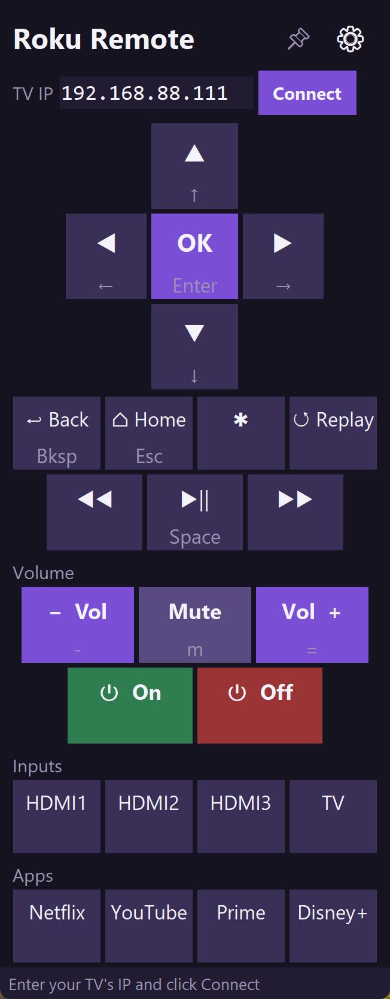

# RokuPyRemote

> **Disclaimer:** This project is not affiliated with, endorsed by, or associated with Roku, Inc. It has only been tested on a **TCL 43S517** Roku TV. It should work with any Roku device that supports the External Control Protocol, but your mileage may vary.

A desktop remote for Roku TVs built with Python and tkinter, using Roku's [External Control Protocol (ECP)](https://developer.roku.com/docs/developer-program/debugging/external-control-api.md).

 



## Features

- D-pad, media controls, volume, power, input switching, app shortcuts
- Customizable key bindings with a built-in settings page
- Pin-to-top mode and system tray support
- Adjustable font size
- Persists IP, key bindings, and settings across sessions
- No external dependencies (standard library only)

## Usage

```
python roku_remote.py
```

Enter your TV's local IP and click **Connect**. You can also build a standalone `.exe` with `build_exe.bat` (uses [PyInstaller](https://pyinstaller.org)).

## Default Keyboard Shortcuts

| Key | Action |
|---|---|
| Arrow keys | D-pad |
| Enter | Select |
| Backspace | Back |
| Escape | Home |
| Space | Play/Pause |
| `=` / `-` | Volume Up/Down |
| `M` | Mute |

Open **⚙ Settings** to remap keys, remove bindings, or assign keys to additional buttons (rewind, power, HDMI inputs, etc.).

## How It Works

The app sends HTTP POST requests to port 8060 on your Roku device, which is the standard ECP endpoint. No pairing or authentication is required -- the device just needs to be on the same local network.

### Enabling Network Access on Your Roku

Your Roku must have **Network Access** enabled for external control to work:

1. Go to **Settings** > **System** > **Advanced system settings** > **Control by mobile apps**
2. Set **Network access** to **Default** or **Permissive**

Without this, the TV will reject commands from the app.

## Development

Auto-reload on save (requires `pip install watchdog`):

```
python dev.py
```

## License

This project does not currently specify a license.
